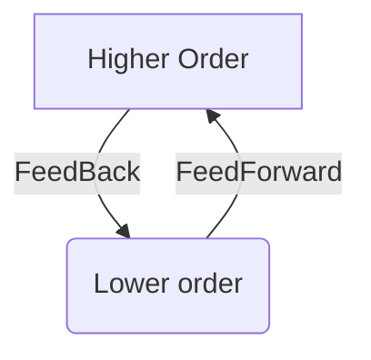

# Intrinsic neural timescales: temporal integration and segregation
---
Wolf, Nikulin, 2021, _Trends in Cognitive Sciences_

#Timescales #Integration #Segregation #Hierarchy #FeedForward #FeedBack #PredictiveCoding 

## Highlights
---

- **Higher-order regions**
	- _Transmodal :_ receive sensory inputs from everywhere (e.g. OFC)
	- _Predict :_  build prediction
	- _Timescale :_ ==longer== timescales (e.g. ACC, OFC)
	- #Integration : i.e. ==combine== information ($\sum_{inputs}$)
- **Lower-order regions**
	- _Unimodal :_ visual, motor, auditory etc.
	- _PE :_ compute Prediction Error
	- _Timescale :_ ==shorter== timescales
	- #Segregation i.e. separate information

## Description
---
### How INT^[**INT** = Intrinsic neuronal timescale] are modified?

- **Timescale modifications :**
	- Longer timescales with increasing node degree (i.e. _transmodal_) vs. smaller node degree (_unimodal_)
	- Regions _more involved_ in the task have more modifications of timescales
	- Longer timescales with _longer delays_

## Link with Predictive Coding

- PC suggests a **hierarchy of prediction**
- Higher-order transmodal send their projection (_feedback_) to lower-order unimodal regions
- Lower-order regions compute a prediction error (`prediction - actual`) and send back this prediction (_feedforward_) to higher-order regions

